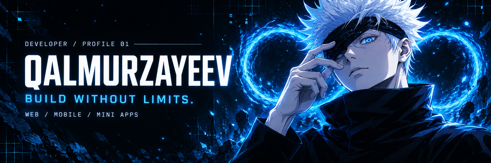
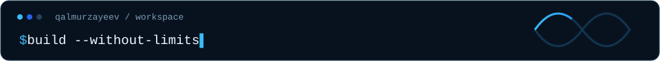
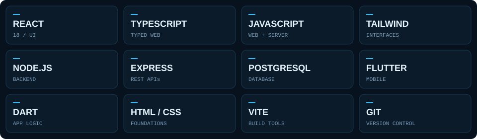
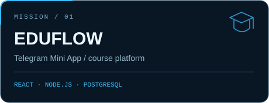
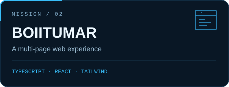
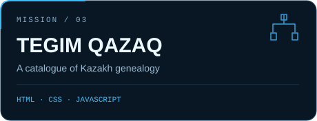
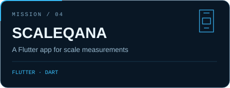
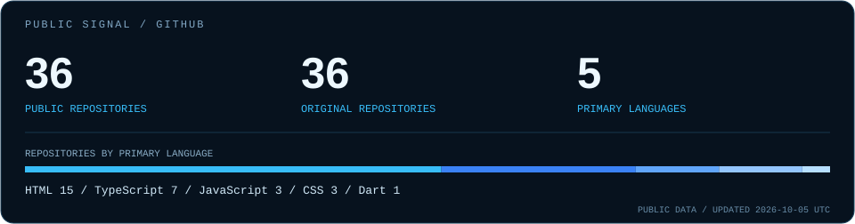

<!-- Original Gojo / Infinity profile for qalmurzayeev. -->
<p align="center">
  
</p>

<p align="center">
  <a href="https://portfolio-beta-amber-88.vercel.app">PORTFOLIO</a> &nbsp; / &nbsp;
  <a href="#03--selected-missions">PROJECTS</a> &nbsp; / &nbsp;
  <a href="https://github.com/qalmurzayeev?tab=repositories">REPOSITORIES</a>
</p>

<p align="center">
  
</p>

## 01 / Behind the code

Веб пен мобильді өнімдер жасаймын: React интерфейстері, Telegram Mini Apps, Node.js серверлері және Flutter қолданбалары. Идеяны түсінікті, қолдануға ыңғайлы өнімге айналдырғанды ұнатамын.

```ts
const developer = {
  name: "qalmurzayeev",
  focus: ["Web", "Mobile", "Telegram Mini Apps"],
  approach: "Think clearly. Build carefully. Keep improving.",
};
```

## 02 / Arsenal

<p align="center">
  
</p>

## 03 / Selected missions

<table>
  <tr>
    <td width="50%" valign="top">
      <a href="https://github.com/qalmurzayeev/academya"></a>
      <br /><strong>EduFlow</strong><br />
      Курстар, сабақтар, прогресс және әкімші панелі бар Telegram Mini App.<br /><br />
      <a href="https://github.com/qalmurzayeev/academya">Source ↗</a> &nbsp; · &nbsp; <a href="https://academya-iota.vercel.app">Live ↗</a>
    </td>
    <td width="50%" valign="top">
      <a href="https://github.com/qalmurzayeev/BOIITUMAR"></a>
      <br /><strong>BOIITUMAR</strong><br />
      React пен TypeScript негізіндегі көпбетті ақпараттық веб-сайт.<br /><br />
      <a href="https://github.com/qalmurzayeev/BOIITUMAR">Source ↗</a> &nbsp; · &nbsp; <a href="https://boiitumar.vercel.app">Live ↗</a>
    </td>
  </tr>
  <tr>
    <td width="50%" valign="top">
      <a href="https://github.com/qalmurzayeev/shezhire-katalog"></a>
      <br /><strong>Tegim Qazaq</strong><br />
      Қазақ шежіресін іздеуге және зерттеуге арналған каталог.<br /><br />
      <a href="https://github.com/qalmurzayeev/shezhire-katalog">Source ↗</a> &nbsp; · &nbsp; <a href="https://shezhire-katalog.vercel.app">Live ↗</a>
    </td>
    <td width="50%" valign="top">
      <a href="https://github.com/qalmurzayeev/scaleqana"></a>
      <br /><strong>Scaleqana</strong><br />
      Өлшеу нәтижелері, дене көрсеткіштері және тарихы бар Flutter қолданбасы.<br /><br />
      <a href="https://github.com/qalmurzayeev/scaleqana">Source ↗</a>
    </td>
  </tr>
</table>

## 04 / Public activity

<p align="center">
  <a href="https://github.com/qalmurzayeev?tab=repositories"></a>
</p>

<p align="center">
  <a href="https://portfolio-beta-amber-88.vercel.app"><strong>Explore my portfolio ↗</strong></a> &nbsp; · &nbsp;
  <a href="https://github.com/qalmurzayeev"><strong>Find me on GitHub ↗</strong></a>
</p>

<p align="center">
  
</p>
